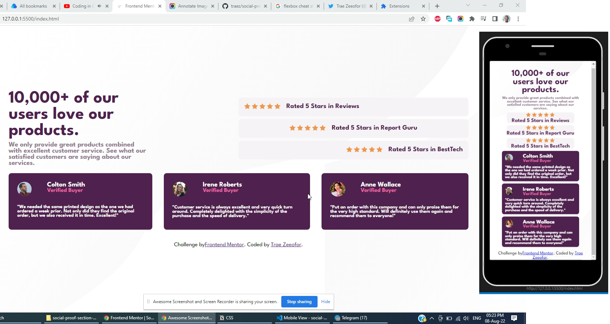

# Frontend Mentor - Social proof section solution

This is a solution to the [Social proof section challenge on Frontend Mentor](https://www.frontendmentor.io/challenges/social-proof-section-6e0qTv_bA). Frontend Mentor challenges help you improve your coding skills by building realistic projects. 

## Table of contents

- [Overview](#overview)
  - [The challenge](#the-challenge)
  - [Screenshot](#screenshot)
  - [Links](#links)
- [My process](#my-process)
  - [Built with](#built-with)
  - [What I learned](#what-i-learned)
  - [Continued development](#continued-development)
  - [Useful resources](#useful-resources)
- [Author](#author)
- [Acknowledgments](#acknowledgments)

## Overview

### The challenge

Users should be able to:

- View the optimal layout for the section depending on their device's screen size

### Screenshot

### Links

- Solution URL: [https://github.com/traez/social-proof-section-master](https://github.com/traez/social-proof-section-master)
- Live Site URL: [https://traez.github.io/social-proof-section-master/](https://traez.github.io/social-proof-section-master/)

## My process

### Built with

- Semantic HTML5 markup
- CSS custom properties
- Flexbox
- CSS Grid
- Mobile-first workflow

### What I learned

Apologies to my future self for turnaround time delays.
Eventually got to use CSS Grid for first time on frontendmentor.io as differentiated from FlexBox.
Most say it's a very powerful tool, and it excites me.

### Continued development

Another media query actually due between mobile and full desktop view but I'm tired much.
So subsequently will explore and practice best responsive CSS Grid use.

### Useful resources

Stackoverflow, MDN Web Docs, Google

## Author

- Website - [Trae Zeeofor](https://github.com/traez)  
- Frontend Mentor - [@traez](https://www.frontendmentor.io/profile/traez)  
- Twitter - [@trae_z](https://twitter.com/trae_z)  

## Acknowledgments

To God who put breathe in my lungs. 
To the dream to make life easier for my future self
